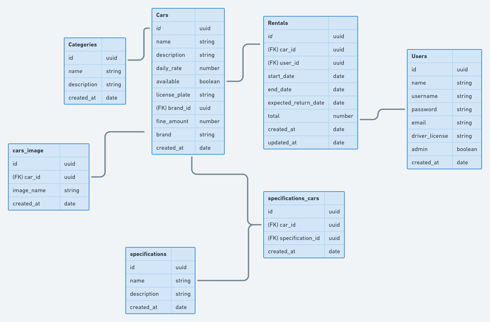

<h1 align="center"> API Rentx </h1>

<p align="center">
  
</p>

## Summary
- [Intro](#intro)
- [Description](#description)
- [Pré-requisitos](#pré-requisitos)
- [Diagrama](#diagram)
- [Acesso ao projeto](#project-access)
- [Open && Run](#open--run)
- [Status](#status)
- [Techniques && Technologies](#techniques--technologies)
- [Owner](#owner)

## Intro
* Rentx é uma API REST monolítico desenvolvida para criar locação de carros. Desenvolvido
como projeto acadêmico junto a Rockeseat dentro do programa Ignite.

## Description
* Diante da API Rentx desenvolveu e utilizou aplicação com uma estrutura monolítica colocando em
produção, configurou protocolo de rede, criou armazenamento de arquivos, serviço envio de e-mail. Desenvolveu sistema de autenticação de usuário com refresh-token, modelou de dados e  relacionamento, criou versionamento da base de dado, testou regra de negócios e fluxo I/O, criou serviços para orquestrar containers, configurou conversor de código em JavaScript, criou funções de segurança, documentou rotas, utilizou acrônimos para responsabilidade única, substituição de serviço e uso de hierarquia, monitorou e tratou de erros, modelou use cases, utilizou conceitos e boas práticas na linguagem de programação, manipulou arquivos, diretórios e nome de arquivos, automatizou atualizações, formatou datas, criptografou informações, utilizou banco de dados relacional, desacoplou módulos, restringiu dados sensíveis e desenvolveu estrutura escalável por camadas. Com isso, adquiriu experiência para criar aplicações desde o ambiente de desenvolvimento até em produção. Criou habilidades de comportamento significativa para o desenvolvimento 
profissional como programador com resultados de 9 a 10 nos desafios acadêmicos.

## Pré-requisitos
* Antes de começar, você vai precisar ter instalado em sua máquina as seguintes ferramentas:
[Node.js](https://nodejs.org/en/). 
E o banco de dados Postgres:
[Postgres](https://www.postgresql.org/).
E o docker para utilizar docker-compose para subir o container do Postgres
[Docker](https://https://www.docker.com/).
E instalar o docker-compose pra subir o container.
[Docker-Compose](https://docs.docker.com/compose/install/).
Além disto é bom ter um editor para trabalhar com o código como 
[VSCode](https://code.visualstudio.com/).

## Diagram


## Project access

### Open && Run
```bash
# Clone este repositório
$ git clone <https://github.com/kaiomoreira-dev/api-rentx.git>

# Acesse a pasta do projeto no terminal/cmd
$ cd rentx

# Instale as dependências
$ yarn ou npm install


# Exutar apenas o container do postgres
$ docker-compose up -d

# Rodar as mirgations do banco
$ yarn migrations

# Build do projeto
$ yarn build

## Iniciar aplicação

// desenvolvimento
$ yarn dev ou npm run dev

// teste
$ yarn test ou npm run test

# O servidor inciará na porta:3333 - acesse <http://localhost:3333>

# O banco de dados do postgres fica no docker na porta 5432:5432
```
## Status 
* Aplicação finalizada devido ao término das atividades acadêmicas. Tendo como objetivo concretizar ensinamentos e o denvolvimento profissional.


## Techniques && Technologies

* 
* 
* 
* 
* 
* 
* 
* 
* 
* 
* 
* 
* 
* 
* 
* 
* 
* 
* 
* 
* 
* 
* 
* 
* 
* 
* 
* 
* 
* 
* 


# Owner
[<br><sub>Kaio Moreira</sub>](https://github.com/kaiomoreira-dev)

[<br><sub>Rocketseat</sub>](https://github.com/rocketseat-education)
